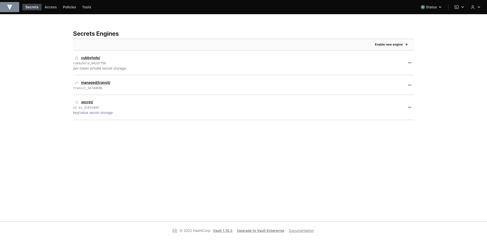
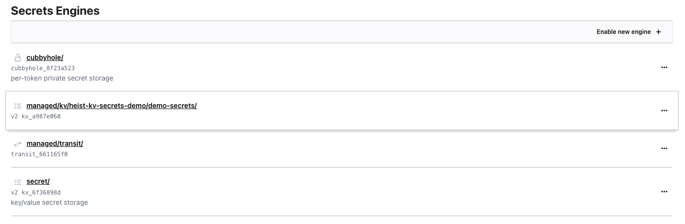
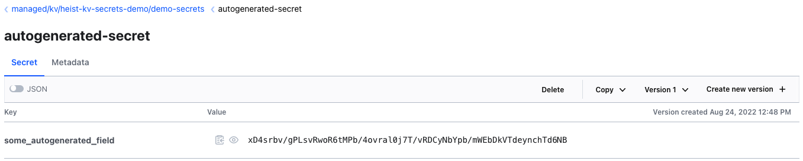
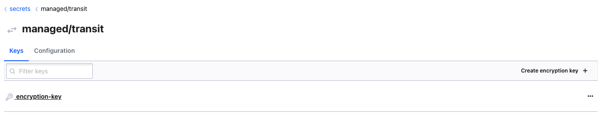
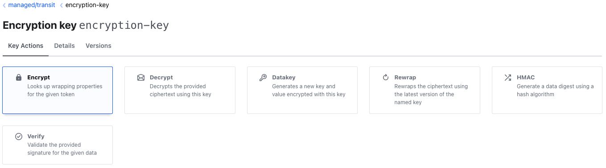
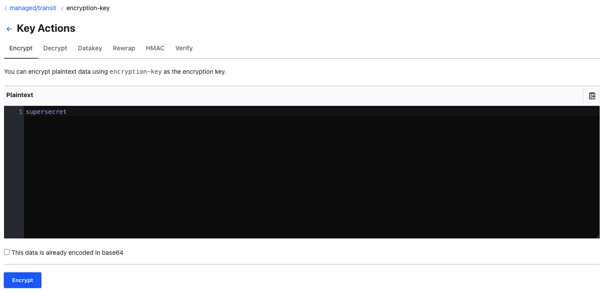
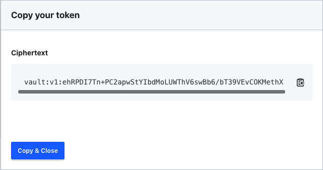
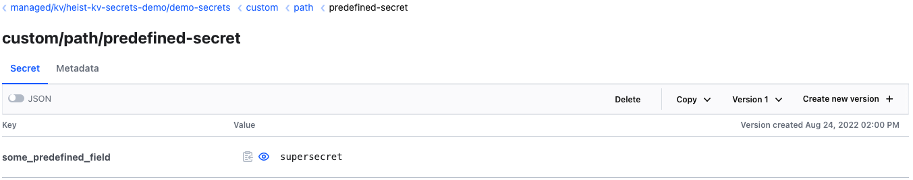

# How to setup and use Key-Value (KV) Secrets

## Introduction

In this tutorial, you will configure and generate a HashiCorp Vault KV Secret
Engine and secrets. We will look at a few common cases where plain KV secerts
are used:
- Generating a random secret
- Generating a pre-defined secret

We will also configure a Pod to mount the secrets, so applications are able to
use them.

## Prerequisites

- [Familiarity with Kubernetes Concepts](https://www.digitalocean.com/community/tutorials/an-introduction-to-kubernetes)
- A Kubernetes Cluster with Heist and HashiCorp Vault installed and configured
  with one of these setup methods:
  - [Production ready cluster, Heist and Vault deployment](../deploy.md)
  - [Development setup with kind](./getting-heist-running-kind.md)
- Vault CLI installed and setup

## Step 1 - Generating a KV Secret engine

This, or similar, is how the Vault UI should look like after following the
prerequisites:



If your Vault installation doesn't expose the Vault service with a reachable
IP, you can use kubectl's built-in port forward to get access to the UI:

```bash
kubectl port-forward -n vault service/vault 8200:8200
```

At first we are going to create a new Kubernetes namespace in which all
Kubernetes resources will reside in:

```bash
kubectl create namespace heist-kv-secrets-demo
# label namespace for pod create webhook to inject heist agent on pod create
# events
kubectl label ns heist-kv-secrets-demo heist.youniqx.com/inject-agent=true
```

To configure the current kubectl context to use the new namespace you can use
[kubens](https://github.com/ahmetb/kubectx):

```bash
kubens heist-kv-secrets-demo
```

or use the default kubectl config command:

```bash
kubectl config set-context --current --namespace heist-kv-secrets-demo
```

Next, we have to create a KV Engine. This engine is used as a generic Key-Value
secret store that will hold all secrets created. Heist only uses the KV
Verison 2. To create a secret engine, the resource `VaultKVSecretEngine` is
used:

```bash
kubectl apply -f - <<'EOF'
apiVersion: heist.youniqx.com/v1alpha1
kind: VaultKVSecretEngine
metadata:
  name: demo-secrets
  namespace: heist-kv-secrets-demo
spec:
  deleteProtection: false
  maxVersions: 10
EOF
```

There are two optional fields that can be configured, a delete protection
preventing deletion of secrets and the number of previous versions that will be
kept when a secret is rotated.

Verify that the KV Secret Engine was created successfully:

```bash
kubectl get vaultkvsecretengine
```

Which should output:

```txt
NAME           PROVISIONED   AGE
demo-secrets   True          4s
```

We can also verify that a new secrets engine was created via the Vault UI:



KV Engines created by Heist follow the naming scheme
`managed/kv/<namespace>/<name>`, resulting in
`managed/kv/heist-kv-secrets-demo/demo-secrets`.

## Step 2 - Generating autogenerated secrets

If the value of a secret doesn't matter, it is easiest to let Vault
autogenerate a random one. This is supported by Heist when configuring
the fields of a `VaultKVSecret`. With this resource, an actual secret gets
generated or populated in the engine:

```bash
kubectl apply -f - <<'EOF'
apiVersion: heist.youniqx.com/v1alpha1
kind: VaultKVSecret
metadata:
  name: autogenerated-secret
  namespace: heist-kv-secrets-demo
spec:
  engine: demo-secrets
  fields:
    some_autogenerated_field:
      autoGenerated: true
EOF
```

Verify that the KV Secret was created successfully:

```bash
kubectl get vaultkvsecret
```

Which should output:

```txt
NAME                   PROVISIONED   AGE
autogenerated-secret   True          42s
```

Similarly, we can see the secret in the Vault UI:



By default, Heist chooses a secret length of 64 random characters. Autogenerated
secrets are created by the Random Vault endpoint using a base64 output format.
If you wish to configure a different secret length, you can set the field
`autoGeneratedLength`:

```yaml
spec:
  fields:
    some_autogenerated_field:
      autoGenerated: true
      autoGeneratedLength: 64
```

## Step 3 - Populating pre-defined secrets

While for some use cases it is fine to use autogenerated secrets, there are
many that require the use of pre-defined secrets. Heist supports this with the
use of a transit engine, which is used to encrypt/decrypt the secret. For this,
Heist automatically creates a transit engine named `managed/transit` during the
initialization.

In the tranist engine a default encryption key exists:



The transit key by default supports multiple operations:



For the KV Secret, we only need the encryption and decryption functions. We
will use the transit key to generate the ciphertext for the cleartext
`supersecret`:



This results in the ciphertext
`vault:v1:ehRPDI7Tn+PC2apwStYIbdMoLUWThV6swBb6/bT39VEvCOKMethX`:



After generating the cipher, we have all the information required for the
VaultKVSecret resource. We can directly copy the value from the Vault UI and
use it in the `ciphertext` field:

```bash
kubectl apply -f - <<'EOF'
apiVersion: heist.youniqx.com/v1alpha1
kind: VaultKVSecret
metadata:
  name: predefined-secret
  namespace: heist-kv-secrets-demo
spec:
  engine: demo-secrets
  path: custom/path
  fields:
    some_predefined_field:
      ciphertext: vault:v1:ehRPDI7Tn+PC2apwStYIbdMoLUWThV6swBb6/bT39VEvCOKMethX
EOF
```

Verify that the KV Secret was created successfully:

```bash
kubectl get vaultkvsecret
```

Which should output:

```txt
NAME                   PROVISIONED   AGE
autogenerated-secret   True          69m
predefined-secret      True          11s
```

When checking the secret in the Vault UI, we can see that the secret was
correctly populated with the cleartext `supersecret`:



The decryption of the value happens during the creation of the Vault KV Secret
by Heist. Similar to the way we encrypted the value, Heist uses the transit
engine to decrypt the value. The cleartext then gets stored in the KV secret
based on the resource configuration. Since the resource defines a `path`,
the secret will be stored at
`/managed/kv/heist-kv-secrets-demo/demo-secrets/custom/path`.

Heist supports updating the secret by changing the value configured in the
`VaultKVSecret`, which makes Heist a great extension to a GitOps setup to
securely check-in seal-encrypted secrets into a VCS.

## Step 4 - Mounting the secrets into a Pod

To mount the secrets into a Pod, we will first create a ServiceAccount:

```bash
kubectl apply -f - <<'EOF'
apiVersion: v1
kind: ServiceAccount
metadata:
  name: ubuntu
  namespace: heist-kv-secrets-demo
EOF
```

Next, we will configure a VaultBinding telling Heist to configure a Heist Agent
Sidecar that will fetch and provide secrets based on the Config:

```bash
kubectl apply -f - <<'EOF'
apiVersion: heist.youniqx.com/v1alpha1
kind: VaultBinding
metadata:
  name: ubuntu-secrets-binding
  namespace: heist-kv-secrets-demo
spec:
  subject:
    name: ubuntu
  kvSecrets:
    - name: autogenerated-secret
    - name: predefined-secret
  agent:
    templates:
      - path: autogenerated
        template: '{{ kvSecret "autogenerated-secret" "some_autogenerated_field"}}'
      - path: predefined
        template: '{{ kvSecret "predefined-secret" "some_predefined_field"}}'
EOF
```

The VaultBinding will also create Vault policies that allow the configured
Kubernetes Service Account to access the required secrets. The Heist Sidecar
Pod thus only has access to the secrets that are explicitly listed,
which follows the least-privilege principle.

To mount the secrets, we now only have to create a deployment (or similar) to
create a Pod. The Pod must have the annotation `heist.youniqx.com/inject-agent`
so the Injector MutatingWebhook injects a Heist Agent Sidecar. The secrets will
be fetched by the Heist Agent and provided to the application Pod via a shared
`InMemory` Volume:

```bash
kubectl apply -f - <<'EOF'
apiVersion: apps/v1
kind: Deployment
metadata:
  name: ubuntu
  namespace: heist-kv-secrets-demo
spec:
  replicas: 1
  selector:
    matchLabels:
      app: ubuntu
  template:
    metadata:
      labels:
        app: ubuntu
      annotations:
        heist.youniqx.com/inject-agent: "true"
    spec:
      serviceAccountName: ubuntu
      containers:
      - image: ubuntu
        name: ubuntu
        command:
        - sleep
        - "3000"
EOF
```

If no Sidecar Agent is injected, you should verify that the namespace has the
correct labels set for the Webhook. The value shown for the
`heist-kv-secrets-demo` namespace must be true:

```bash
kubectl get namespaces -L heist.youniqx.com/inject-agent
```

If the Agent was injected correctly, we can connect into the ubuntu container
and verify the secrets were synced successfully:

```bash
kubectl exec -ti "$(kubectl get pods -l=app=ubuntu --no-headers --output name | head -n1)" -c ubuntu -- bash
# inside the pod run
find /heist
```

Which should output:

```txt
/heist
/heist/secrets
/heist/secrets/predefined
/heist/secrets/autogenerated
/heist/config.json
```

As we can see, the two secrets were fetched into the Memory Volume mounted at
`/heist`. The Heist Agent will keep the secrets in-sync with the latest
version stored in the Vault KV Engine. If the application supports secret
reloading, secret rotations are possible without a Pod restart.

## Step 5 - Syncing secrets into a Kubernetes Secret

If it is not possible to use the Heist Agent for some reason, it is also
possible to configure a `VaultSyncSecret` resource, which syncs the KV value
into a plain Kubernetes secret. This is also useful when a secret is generated
and stored for namespace `A` and namespace `B` also needs access.

> Be sure to check that the Heist Operator has permissions to create Kubernetes
> secrets in the configured namespace: [VaultSyncSecret](../crds/vaultsyncsecret.md).
> When using Heist with the kind setup, the `default` namespace is automatically
> configured to be in the allow-list.

To do so, we configure a `VaultSyncSecret` in the `heist-kv-secrets-demo`
namespace:

```bash
kubectl apply -f - <<'EOF'
apiVersion: heist.youniqx.com/v1alpha1
kind: VaultSyncSecret
metadata:
  name: kv-secret-sync
  namespace: heist-kv-secrets-demo
spec:
  target:
    name: "demo-sync-secrets"
    namespace: heist-kv-secrets-demo
    type: Opaque
  data:
    autogenerated:
      kvSecret:
        name: autogenerated-secret
        field: some_autogenerated_field
    predefined:
      kvSecret:
        name: predefined-secret
        field: some_predefined_field
EOF
```

To verify the secrets were synced:

```bash
kubectl get secrets -n default
```

Which should output:

```bash
NAME                TYPE     DATA   AGE
demo-sync-secrets   Opaque   2      13m
```

Additionally, we can check if the correct secret is now stored in the
predefined field:

```bash
kubectl get secrets -o json -n default demo-sync-secrets \
  | jq -r '.data.predefined' \
  | base64 -d
```

Which should output:
```bash
supersecret
```
