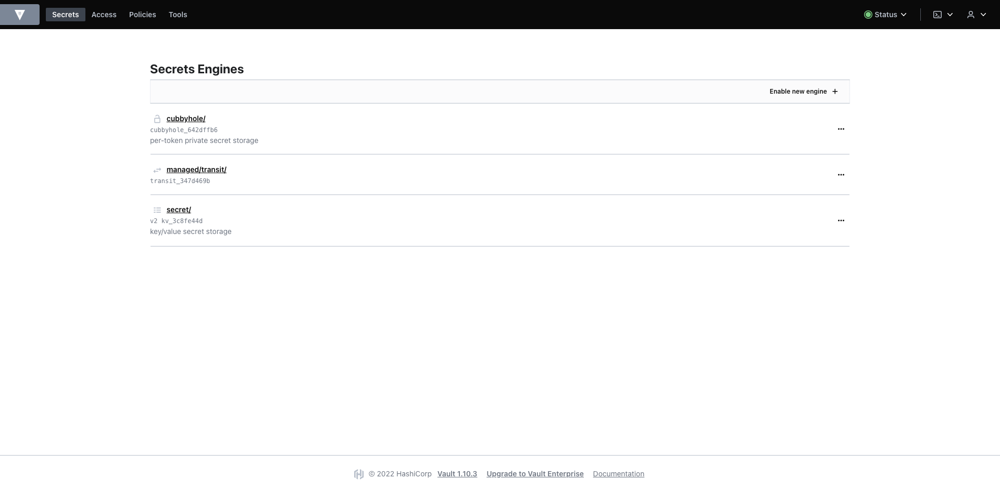

# How to setup a Root and Interemediate Certificate Authorities with Heist

## Introduction

In this tutorial, you will configure and generate a HashiCorp Vault PKI from
scratch, using Heist. We will configure a Root Certificate Authority (CA), an
Intermediate CA and manually issue a certificate with the Vault UI. The
tutorial can be followed with a local kind or minikube cluster, or a multi-node
test or production kubernetes environment.

## Prerequisites

To follow this tutorial you need:

- [Familiarity with Kubernetes Concepts](https://www.digitalocean.com/community/tutorials/an-introduction-to-kubernetes)
- A Kubernetes Cluster with Heist and HashiCorp Vault installed and configured
  with one of these setup methods:
  - [Production ready cluster, Heist and Vault deployment](../deploy.md)
  - [Development setup with kind](./gettings-heist-running-kind.md)
- Familiarity with Public Key Infrastructures (PKIs) Concepts
- Vault CLI installed and setup

## Step 1 - Setting up PKI Engine and Root CA

This, or similar, is how the Vault UI should look like after following the
preqreuisites:



If your Vault installation doesn't expose the Vault service with a reachable
IP, you can use kubectl's built-in port forward to get access to the UI:

```bash
kubectl port-forward -n vault service/vault 8200:8200
```

At first we are going to create a new Kubernetes namespace in which all
Kubernetes resources will reside in. This enables an easy cleanup once the PKI
is not needed anymore:

```bash
kubectl create namespace heist-pki-demo
```

To configure the current kubectl context to use the new namespace you can use
[kubens](https://github.com/ahmetb/kubectx):

```bash
kubens heist-pki-demo
```

or use the default kubectl config command:

```bash
kubectl config set-context --current --namespace heist-pki-demo
```

To be able to issue Certificate Authorities (CAs) and Certificates we first
need to configure a PKI engine in Vault. This is done by defining a
[VaultCertificateAuthority](../crds/vaultcertificateauthority.md) resource:

```bash
kubectl apply -f - <<'EOF'
apiVersion: heist.youniqx.com/v1alpha1
kind: VaultCertificateAuthority
metadata:
  name: demo-root-ca
  namespace: heist-pki-demo
spec:
  issuer: "" # leaving this empty implicitly configures the CA to be the root CA
  subject:
    organization: [ "youniqx Identity AG" ]
    ou: [ "infrastructure" ]
    country: [ "AT" ]
    locality: [ "Vienna" ]
    streetAddress: [ "Tenschertstraße 7" ]
    postalCode: [ "1239" ]
    commonName: "Demo Root CA"
  tuning: # optional CA tuning
    defaultLeaseTTL: "87600h"
    description: "Demo Root CA, used to demonstrate Heist's PKI management"
  settings: # optional CA settings
    subjectAlternativeNames: []
    ipSans: []
    uriSans: []
    otherSans: []
    ttl: "175200h"
    keyType: rsa # or ec
    keyBits: 4096
    excludeCNFromSans: false
    exported: false
EOF
````

Verifying provisioning was successful:

```bash
kubectl get vaultcertificateauthorities.heist.youniqx.com
```

Which should output:

```txt
NAME           PROVISIONED   AGE
demo-root-ca   True          11s
```

Creating a `VaultCertificateAuthority` resource sets up multiple things in
Vault. It creates a new PKI engine that follows the naming scheme
`managed/pki/<namespace>/<resource-name>`. The above created Root CA has the
engine name `managed/pki/demo-root-ca/heist-pki-demo`. Additionally, an entry
in the `managed/_heist_internal` KV Engine is created, containing the public
information for the CA (certificate, full_certificate_chain, information about
the issuer and the certificates serial number, ...). If the
`spec.settings.exported` field is set to false, no private key information is
stored in the internal engine. Depending how the CA is intended to be used it
might be necessary to have the private key retrievable. Since we won't need
the private key and let Vault handle all certificate signing and issuing, we
configure it to false.


Aside from the PKI engine Heist creates the actual Root CA key and self-signs
the certificate with the provided subject settings. Additional tuning of the CA
is possible with the `tuning` field.

There are also two default Vault policies created. These grant minimal access
to read the Certificate in the `managed/_heist_internal` engine. These policies
are named `managed.pki.ca.private.<namespace>.<resource-name>` and
`managed.pki.ca.public.<namespace>.<resource-name>`. Since the private key
is not exported, no private key information is stored in this engine. Only
the certificate, full_chain and other certificate information is exposed.

```bash
vault policy read managed.pki.ca.public.heist-pki-demo.demo-root-ca
```

Which should output:

```txt
path "managed/_heist_internal/data/heist-pki-demo/pki/ca/public/demo-root-ca" {
  capabilities = ["read"]
}
```

```bash
vault policy read managed.pki.ca.private.heist-pki-demo.demo-root-ca
```

Which should output:

```txt
path "managed/_heist_internal/data/heist-pki-demo/pki/ca/private/demo-root-ca" {
  capabilities = ["read"]
}
```

## Step 2 - Issuing an Intermediate CA

In this step we will issue an Intermediate CA (Int CA) that is able to issue
server certificates. To do so we first have to create another
`VaultCertificateAuthority` resource, similiar to the root CA:

```bash
kubectl apply -f - <<'EOF'
apiVersion: heist.youniqx.com/v1alpha1
kind: VaultCertificateAuthority
metadata:
  name: demo-int-ca
  namespace: heist-pki-demo
spec:
  issuer: "demo-root-ca"
  subject:
    organization: [ "youniqx Identity AG" ]
    ou: [ "infrastructure" ]
    country: [ "AT" ]
    locality: [ "Vienna" ]
    streetAddress: [ "Tenschertstraße 7" ]
    postalCode: [ "1239" ]
    commonName: "Demo Int CA"
  tuning: # optional CA tuning
    defaultLeaseTTL: "87600h"
    description: "Demo Int CA, used to demonstrate Heist's PKI management"
  settings:
    subjectAlternativeNames: []
    ipSans: []
    uriSans: []
    otherSans: []
    ttl: "175200h"
    keyType: rsa # or ec
    keyBits: 4096
    excludeCNFromSans: false
    exported: false
EOF
```

Verifying that the Int CA was provisioned correctly:

```bash
kubectl get vaultcertificateauthorities.heist.youniqx.com
```

Which should output:

```txt
NAME           PROVISIONED   AGE
demo-int-ca    True          11s
demo-root-ca   True          36m
```

This is the intermediate certificate when described with openssl. The
certificate was retrieved manually via the Vault UI and copied into a file
named `cert.pem`. In the output we can see that Vault correctly configured the
certificate fields, subjects and extensions:

```bash
openssl x509 -in cert.pem -noout -text
```

Which should output:

```txt
Certificate:
    Data:
        Version: 3 (0x2)
        Serial Number:
            40:f9:88:cf:86:d6:8c:2a:1a:8d:f4:04:33:79:70:5a:37:21:7a:f6
    Signature Algorithm: sha256WithRSAEncryption
        Issuer: C=AT, L=Vienna/street=Tenschertstra\xC3\x9Fe 7/postalCode=1239, O=youniqx Identity AG, OU=infrastructure, CN=Demo Root CA
        Validity
            Not Before: Aug  3 13:42:52 2022 GMT
            Not After : Jul 29 13:43:22 2042 GMT
        Subject: C=AT, L=Vienna/street=Tenschertstra\xC3\x9Fe 7/postalCode=1239, O=youniqx Identity AG, OU=infrastructure, CN=Demo Int CA
        Subject Public Key Info:
            Public Key Algorithm: rsaEncryption
                Public-Key: (4096 bit)
                Modulus:
                    00:dd:37:d3:bf:27:ba:87:87:cc:5f:17:68:10:f4:
                    ....
                Exponent: 65537 (0x10001)
        X509v3 extensions:
            X509v3 Key Usage: critical
                Certificate Sign, CRL Sign
            X509v3 Basic Constraints: critical
                CA:TRUE
            X509v3 Subject Key Identifier:
                E5:A8:2A:0E:F2:8E:73:5D:5E:C3:45:BB:A4:56:8D:9A:13:6E:95:AB
            X509v3 Authority Key Identifier:
                keyid:A9:06:1E:96:9E:BB:EB:14:2D:81:B4:BD:48:D3:BE:A5:EA:DA:F3:0F

            Authority Information Access:
                CA Issuers - URI:http://vault.vault.svc.cluster.local:8200/v1/managed/pki/heist-pki-demo/demo-root-ca/ca

            X509v3 CRL Distribution Points:

                Full Name:
                  URI:http://vault.vault.svc.cluster.local:8200/v1/managed/pki/heist-pki-demo/demo-root-ca/crl

    Signature Algorithm: sha256WithRSAEncryption
         2c:80:35:b8:7f:57:ad:6d:18:26:13:e2:f7:96:05:65:1e:1b:
         ....
```

## Step 3 - Issuing Server Certificates with Vault CLI

With the current configuration it is not yet possible to issue certificates
because Vault requires a certificate role defining which configurations are
allowed. These configurations determine for example whether it is possible for
the CA to issue only server certificates, only client certificates, certificate
extensions and much more.

These roles are created by another Heist resource,
the [VaultCertificateRole](../crds/vaultcertificaterole.md).
Since in this tutorial we only want to issue server certificates from the Int
CA we will configure the resource with these restrictions:

```bash
kubectl apply -f - <<'EOF'
apiVersion: heist.youniqx.com/v1alpha1
kind: VaultCertificateRole
metadata:
  name: example-certificate-role
  namespace: heist-pki-demo
spec:
  issuer: demo-int-ca
  subject:
    organization: [ "youniqx Identity AG" ]
    ou: [ "infrastructure" ]
    country: [ "AT" ]
    locality: [ "Vienna" ]
    streetAddress: [ "Tenschertstraße 7" ]
    postalCode: [ "1239" ]
  settings:
    allowedDomains: [ "example.com" ]
    allowGlobDomains: true
    allowSubdomains: true
    allowBareDomains: true
    requireCN: true
    ttl: "8640h" # 1 year ttl
    keyBits: 2048
    keyType: rsa
    serverFlag: true
EOF
```

Verify that the VaultCertificateRole was provisioned correctly:

```bash
kubectl get vaultcertificateroles
```

Which should output:

```txt
NAME                       PROVISIONED   AGE
example-certificate-role   True          21s
```

We can see, that Heist was able to successfully provision the
`VaultCertificateRole`. With this configuration a new option in the Role tab of
the Int CA is shown:


When selecting the role, we are able to issue a certificate with one or
multiple `example.com` subdomains:


Other domains than `*.example.com` would result in a vault error. Since all
settings are ok everything worked as expected and the certificate was issued:


When inspecting the certificate with openssl, we see that all fields and
extensions are set as we configured it:

```bash
openssl x509 -in cert.pem -noout -text
```

Which should output:

```txt
Certificate:
    Data:
        Version: 3 (0x2)
        Serial Number:
            33:d5:c5:58:0b:ce:60:3b:c7:89:86:ca:45:0a:cd:10:a8:44:8f:6f
    Signature Algorithm: sha256WithRSAEncryption
        Issuer: C=AT, L=Vienna/street=Tenschertstra\xC3\x9Fe 7/postalCode=1239, O=youniqx Identity AG, OU=infrastructure, CN=Demo Int CA
        Validity
            Not Before: Aug  3 14:04:54 2022 GMT
            Not After : Jul 29 14:05:23 2023 GMT
        Subject: C=AT, L=Vienna/street=Tenschertstra\xC3\x9Fe 7/postalCode=1239, O=youniqx Identity AG, OU=infrastructure, CN=test.example.com
        Subject Public Key Info:
            Public Key Algorithm: rsaEncryption
                Public-Key: (2048 bit)
                Modulus:
                    00:a3:e3:a4:55:79:47:71:9a:fc:1e:80:52:75:ae:
                    ...
                Exponent: 65537 (0x10001)
        X509v3 extensions:
            X509v3 Extended Key Usage:
                TLS Web Server Authentication
            X509v3 Subject Key Identifier:
                03:F4:34:97:11:6C:08:C8:5B:EB:A6:32:AB:C2:F6:AE:DD:3F:90:52
            X509v3 Authority Key Identifier:
                keyid:E5:A8:2A:0E:F2:8E:73:5D:5E:C3:45:BB:A4:56:8D:9A:13:6E:95:AB

            Authority Information Access:
                CA Issuers - URI:http://vault.vault.svc.cluster.local:8200/v1/managed/pki/heist-pki-demo/demo-int-ca/ca

            X509v3 Subject Alternative Name:
                DNS:test-2.example.com
            X509v3 CRL Distribution Points:

                Full Name:
                  URI:http://vault.vault.svc.cluster.local:8200/v1/managed/pki/heist-pki-demo/demo-int-ca/crl

    Signature Algorithm: sha256WithRSAEncryption
         7d:6d:5c:d9:9c:c7:c6:e8:0a:d6:fc:54:c1:c7:f5:0a:26:d0:
         ...
```

## Related tutorials

- [Configuring TLS certificates for nginx](how-to-setup-tls-certificates-for-nginx.md)
