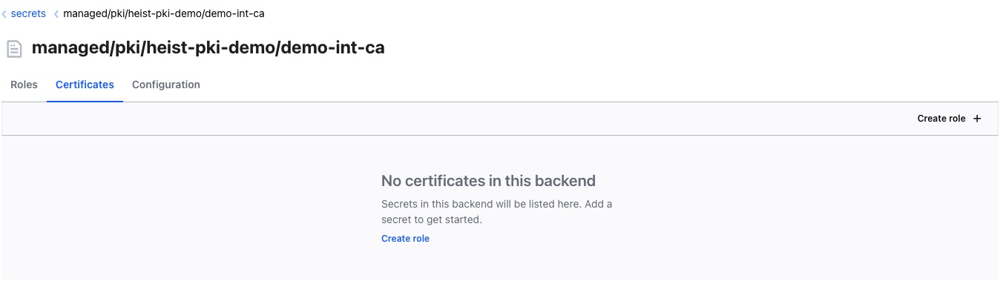

# How to setup TLS certificates for an nginx deployment

## Introduction

In this tutorial, you will configure and generate a HashiCorp Vault PKI
certificate. We will then configure resources to mount the certificate
and private key into an nginx deployment with the Heist agent. Additionally,
we will configure Heist to populate the certificate and key into a plain
Kubernetes TLS secret.

## Prerequisites

To follow this tutorial you need:

- [Familiarity with Kubernetes Concepts](https://www.digitalocean.com/community/tutorials/an-introduction-to-kubernetes)
- A Kubernetes Cluster with Heist and HashiCorp Vault installed and configured
  with one of these setup methods:
  - [Production ready cluster, Heist and Vault deployment](../quick-start.md)
  - [Development setup with kind](./getting-heist-running-kind.md)
- Vault CLI installed and setup
- [A working Root and Intermediate CA and Certificate Role](./how-to-setup-root-and-intermediate-certificate-authorities-with-heist.md)

Before continuing these resources are expected to already exist in the namespace
`heist-pki-demo`:
- Root CA
- Intermediate CA
- VaultCertificateRole that can issue certs for example.com domain

## Step 1 - Preparing the VaultBinding to create a certificate

In Heist actual certificates can be created in two ways. The first, which we
are going to look at first, is with a `VaultBinding`. With a VaultBinding the
Heist Agent Sidecar is responsible for fetching the certificate and/or the
private key, in order to provide it to the application container.

Each VaultBinding associates a Kubernetes ServiceAccount with one or more
secrets. For this ServiceAccount Vault policies are created that prevent other
pods from accessing secrets that they should not have access to. All
Authorization is handled by Vault, all authentications are handled initially
by Vault, which forwards the requests to the Kubernetes API server to handle
the Authentication.

We first create a new ServiceAccount that will be used to run the Deployment:

```bash
kubectl apply -f - <<'EOF'
apiVersion: v1
kind: ServiceAccount
metadata:
  name: nginx
  namespace: heist-pki-demo
EOF
```

Additionally, we create a VaultBinding allowing the ServiceAccount to read the
Certificate and Private Key for the certificate.

```bash
kubectl apply -f - <<'EOF'
apiVersion: heist.youniqx.com/v1alpha1
kind: VaultBinding
metadata:
  name: nginx-tls-binding
  namespace: heist-pki-demo
spec:
  subject:
    name: nginx
  certificateRoles:
    - name: "example-certificate-role"
      capabilities: [ "issue" ]
  agent:
    certificateTemplates:
      - alias: "test_nginx_tls_cert"
        certificateRole: "example-certificate-role"
        commonName: test.example.com
        dnsSans: [ "internal-test.example.com" ]
    templates:
      - path: tls.key
        template: '{{ certField "test_nginx_tls_cert" "private_key" }}'
      - path: tls.crt
        template: '{{ certField "test_nginx_tls_cert" "certificate" }}'
      - path: cachain.crt
        template: '{{ certField "test_nginx_tls_cert" "cert_chain" }}'
EOF
```

The created VaultBinding configuration works for the ServiceAccount `nginx`. It
is always assumed, that the Binding resources are created in the same namespace
as the pod requiring the secret.

In the binding, we have to specify which CertificateRole will be used while
issuing the certificate. The issue capability is the minimum required to allow
the bound ServiceAccount to issue the configured certificate. Other possible
options are listed at the [VaultBinding documentation](../crds/vaultbinding.md#Capabilities).

In `agent` the actual certificate template and mount settings are configured.
With the certificateTemplates we configure that a certificate valid for the two
domains `test.example.com` and `internal-test.example.com` is issued. It would
also be possible to configure custom Sans using OIDs. Since we are using the
certificate for TLS, no custom extensions are required. In the templates section
the actual mount settings are configured. These are the relative paths that are
used by the agent to sync the certificate, private key and the full CA chain.

To verify that everything worked as expected:

```bash
kubectl get vaultbindings
```

Which should output:

```txt
NAME                PROVISIONED   ACTIVE   AGE
nginx-tls-binding   True          True     7s
```

When looking at the Intermediate CA in Vault, we can see that no certificates
were issued yet (there might still be an older one that was created while
setting up the CA chains, this can be ignored):



In the background however, Heist has already prepared two things for the new
certificate:
- The Vault role for the ServiceAccount to issue a new certificate, named
  `managed.k8s.heist-pki-demo.nginx`
- The `VaultClientConfig` that will be read by the agent sidecar, named after
  the bound service account `nginx`

## Step 2 - Creating and mounting the certificate

Before continuing, we have to ensure the agent injection is enabled for the
namespace, otherwise the Kubernetes webhook won't be sent to the heist
injector:

```bash
kubectl get namespaces heist-pki-demo -L heist.youniqx.com/inject-agent
```

If the column `INJECT-AGENT` is empty or set to false, we have to add the label
`heist.youniqx.com/inject-agent` with a value of true:

```bash
kubectl label ns heist-pki-demo heist.youniqx.com/inject-agent=true
```

After labeling the namespace, the output should look similar to this:

```txt
NAME             STATUS   AGE   INJECT-AGENT
heist-pki-demo   Active   16h   true
```

Next up we have do define a deployment using the service account so the
certificate gets created by the agent, and shared with the application
container:

```bash
kubectl apply -f - <<'EOF'
apiVersion: apps/v1
kind: Deployment
metadata:
  name: nginx
  namespace: heist-pki-demo
spec:
  replicas: 1
  selector:
    matchLabels:
      app: nginx
  template:
    metadata:
      labels:
        app: nginx
      annotations:
        heist.youniqx.com/inject-agent: "true"
    spec:
      serviceAccountName: nginx
      containers:
      - image: nginx
        name: nginx
        ports:
        - containerPort: 80
EOF
```

When looking into the pod, we can see that Heist successfully injected an
additional container, the Heist agent:

```bash
kubectl get pods
```

Which should output:

```txt
NAME                     READY   STATUS    RESTARTS      AGE
nginx-599887b884-lpmhm   2/2     Running   0             1m
```

This is done with a mutating webhook, which is configured for Pod Create
events. The Heist injector checks if the pod has the injector annotation set,
and if so, automatically injects the Heist sidecar container. Since secrets are
shared with all other containers in the pod, an additional `InMemory` volume
gets attached at the path `/heist`. At this path, all synced secrets will be
available for the application.

We can also verify that the Heist agent successfully fetched and injected the
certificate, key and full_ca_chain by looking at the logs:

```bash
kubectl logs -l=app=nginx -c heist-agent
```

Which should output:

```txt
1.6612682086395507e+09  INFO  agent-server  syncing secrets after config update
1.661268208639554e+09 INFO  agent-server  started syncing secrets
1.661268208639631e+09 INFO  agent successfully listed secrets {"config_namespace": "heist-pki-demo", "config_name": "nginx", "operation": "ListSecrets", "vault_address": "http://vault.vault.svc.cluster.local:8200", "vault_role": "managed.k8s.heist-pki-demo.nginx", "vault_auth_mount_path": "managed/kubernetes", "kv_secret_count": 0, "certificate_count": 1, "ca_count": 0, "transit_key_count": 0, "count": 3}
1.6612682088912346e+09  INFO  agent-server  Secret is new, writing it to the disk for the first time  {"secret_name": "tls.key", "output_path": "/heist/secrets/tls.key", "permissions": "-rw-r-----"}
1.661268208891926e+09 INFO  agent-server  Secret is new, writing it to the disk for the first time  {"secret_name": "tls.crt", "output_path": "/heist/secrets/tls.crt", "permissions": "-rw-r-----"}
1.6612682088925564e+09  INFO  agent-server  Secret is new, writing it to the disk for the first time  {"secret_name": "cachain.crt", "output_path": "/heist/secrets/cachain.crt", "permissions": "-rw-r-----"}
1.6612682088927069e+09  INFO  agent-server  Successfully synced secrets to disk
1.661268251487592e+09 INFO  agent Config has not changed, skipping config update... {"config_namespace": "heist-pki-demo", "config_name": "nginx", "vault_address": "http://vault.vault.svc.cluster.local:8200", "vault_role": "managed.k8s.heist-pki-demo.nginx", "vault_auth_mount_path": "managed/kubernetes", "kv_secret_count": 0, "certificate_count": 1, "ca_count": 0, "transit_key_count": 0, "current_sync_state": "synced"}
```

To inspect the provided secrets, we can open a shell in the nginx container:

```bash
kubectl exec -ti "$(kubectl get pods -l=app=nginx --no-headers --output name | head -n1)" -c nginx -- bash
```

When looking at the shared volume:

```bash
find /heist/
```

The synced secrets and a metadata file can be seen:

```
/heist/
/heist/secrets
/heist/secrets/cachain.crt
/heist/secrets/tls.crt
/heist/secrets/tls.key
/heist/config.json
```

In the folder `/heist/secrets` we can see that all configured secrets were
provisioned correctly and are available to be used by the container. To verify
the certificate fields are set correctly, we can use openssl:

```bash
openssl x509 -in /heist/secrets/tls.crt -text -noout
```

Which should print:

```txt
Certificate:
    Data:
        Version: 3 (0x2)
        Serial Number:
            2b:a2:19:cb:6a:40:4f:05:10:b1:d7:9b:02:69:6b:06:4f:0c:a2:27
        Signature Algorithm: sha256WithRSAEncryption
        Issuer: C = AT, L = Vienna, street = Tenschertstra\C3\9Fe 7, postalCode = 1239, O = youniqx Identity AG, OU = infrastructure, CN = Demo Int CA
        Validity
            Not Before: Aug 23 15:22:58 2022 GMT
            Not After : Aug 18 15:23:28 2023 GMT
        Subject: C = AT, L = Vienna, street = Tenschertstra\C3\9Fe 7, postalCode = 1239, O = youniqx Identity AG, OU = infrastructure, CN = test.example.com
        Subject Public Key Info:
            Public Key Algorithm: rsaEncryption
                RSA Public-Key: (2048 bit)
                Modulus:
                    00:b0:30:88:0f:c9:39:5f:cf:86:a4:6b:8d:89:9c:
                    ...
                Exponent: 65537 (0x10001)
        X509v3 extensions:
            X509v3 Extended Key Usage:
                TLS Web Server Authentication
            X509v3 Subject Key Identifier:
                9A:3E:C9:61:F1:6B:8F:05:1A:71:F0:D0:65:C4:5E:FC:41:EB:2B:30
            X509v3 Authority Key Identifier:
                keyid:00:B1:A6:8C:78:B0:85:3B:6E:91:92:0B:FC:20:4C:81:C7:78:25:F3

            Authority Information Access:
                CA Issuers - URI:http://vault.vault.svc.cluster.local:8200/v1/managed/pki/heist-pki-demo/demo-int-ca/ca

            X509v3 Subject Alternative Name:
                DNS:internal-test.example.com, DNS:test.example.com
            X509v3 CRL Distribution Points:

                Full Name:
                  URI:http://vault.vault.svc.cluster.local:8200/v1/managed/pki/heist-pki-demo/demo-int-ca/crl

    Signature Algorithm: sha256WithRSAEncryption
         62:87:b9:bf:d1:d5:c2:a3:48:08:35:a3:b1:6d:1b:bc:1a:7d:
         ...
```

## Step 3 – Configure nginx to use the certificate and key

To use the certificate and key for tls with nginx, we have to customize the
nginx server config. This will be done by mounting a configmap into the nginx
container. First, the config has to be created:

```bash
kubectl apply -f - <<'EOF'
apiVersion: v1
kind: ConfigMap
metadata:
  name: nginx-config
  namespace: heist-pki-demo
data:
  default.conf: |
    server {
        listen       80;
        listen       443 ssl;
        server_name  test.example.com;

        # It usually is best to provide the full chain to the browser since
        # even with certificates signed by well-known CAs issues might occur
        ssl_certificate     /heist/secrets/cachain.crt;
        ssl_certificate_key /heist/secrets/tls.key;

        location / {
            root   /usr/share/nginx/html;
            index  index.html index.htm;
        }
    }
EOF
```

The created config overwrites the default config and configures a single server
block that will listen for http requests at port 80, and https requests at
port 443. For the https server, the ssl_certificate and ssl_certificate_key
have to be configured with the Heist secrets.

Next, we need to mount the nginx config into the container:

```bash
kubectl apply -f - <<'EOF'
apiVersion: apps/v1
kind: Deployment
metadata:
  name: nginx
  namespace: heist-pki-demo
spec:
  replicas: 1
  selector:
    matchLabels:
      app: nginx
  template:
    metadata:
      labels:
        app: nginx
      annotations:
        heist.youniqx.com/inject-agent: "true"
    spec:
      serviceAccountName: nginx
      containers:
      - image: nginx
        name: nginx
        ports:
        - containerPort: 80
        volumeMounts:
        - name: nginx-config
          mountPath: /etc/nginx/conf.d/
      volumes:
      - name: nginx-config
        configMap:
          name: nginx-config
EOF
```

Since it takes some time for the Heist agent to sync the secrets, you might see
nginx die during startup. This is because the nginx server checks whether the
certificate and key are configured correctly and existing, and if not exits
with an error. Possible ways to handle this are delayed startups of the
application container by checking whether the secrets are ready to be used. A
good way would be for the application to wait for all expected resources to be
ready before continuing.

Alternatively Heist supports fetching the secrets with an InitContainer. This
is configured with [an annotation on the pod](../admin/injector.md). Using an
InitContainer to pre-fetch the secrets might have the draw-back of not working
with other side-cars that change the pod's networking behaviour (e.g. a service
mesh).

To verify the nginx is configured correctly, we can connect into the container
and test the endpoints:

```bash
kubectl exec -ti "$(kubectl get pods -l=app=nginx --no-headers --output name | head -n1)" -c nginx -- bash
# curl inside the nginx container
curl --resolve test.example.com:80:127.0.0.1 http://test.example.com
```

Which should output:

```txt
<!DOCTYPE html>
<html>
<head>
<title>Welcome to nginx!</title>
<style>
html { color-scheme: light dark; }
body { width: 35em; margin: 0 auto;
font-family: Tahoma, Verdana, Arial, sans-serif; }
</style>
</head>
<body>
<h1>Welcome to nginx!</h1>
<p>If you see this page, the nginx web server is successfully installed and
working. Further configuration is required.</p>

<p>For online documentation and support please refer to
<a href="http://nginx.org/">nginx.org</a>.<br/>
Commercial support is available at
<a href="http://nginx.com/">nginx.com</a>.</p>

<p><em>Thank you for using nginx.</em></p>
</body>
</html>
```

Curl against the https server:

```bash
curl -vv --cacert /heist/secrets/cachain.crt --resolve internal-test.example.com:443:127.0.0.1 https://internal-test.example.com
curl -vv --cacert /heist/secrets/cachain.crt --resolve test.example.com:443:127.0.0.1 https://test.example.com
```

Which both should have a similar output to:

```txt
* Added internal-test.example.com:443:127.0.0.1 to DNS cache
* Hostname internal-test.example.com was found in DNS cache
*   Trying 127.0.0.1:443...
* Connected to internal-test.example.com (127.0.0.1) port 443 (#0)
* ALPN, offering h2
* ALPN, offering http/1.1
* successfully set certificate verify locations:
*  CAfile: /heist/secrets/cachain.crt
*  CApath: /etc/ssl/certs
* TLSv1.3 (OUT), TLS handshake, Client hello (1):
* TLSv1.3 (IN), TLS handshake, Server hello (2):
* TLSv1.2 (IN), TLS handshake, Certificate (11):
* TLSv1.2 (IN), TLS handshake, Server key exchange (12):
* TLSv1.2 (IN), TLS handshake, Server finished (14):
* TLSv1.2 (OUT), TLS handshake, Client key exchange (16):
* TLSv1.2 (OUT), TLS change cipher, Change cipher spec (1):
* TLSv1.2 (OUT), TLS handshake, Finished (20):
* TLSv1.2 (IN), TLS handshake, Finished (20):
* SSL connection using TLSv1.2 / ECDHE-RSA-AES256-GCM-SHA384
* ALPN, server accepted to use http/1.1
* Server certificate:
*  subject: C=AT; L=Vienna; street=Tenschertstra�e 7; postalCode=1239; O=youniqx Identity AG; OU=infrastructure; CN=test.example.com
*  start date: Aug 23 16:11:12 2022 GMT
*  expire date: Aug 18 16:11:42 2023 GMT
*  subjectAltName: host "internal-test.example.com" matched cert's "internal-test.example.com"
*  issuer: C=AT; L=Vienna; street=Tenschertstra�e 7; postalCode=1239; O=youniqx Identity AG; OU=infrastructure; CN=Demo Int CA
*  SSL certificate verify ok.
> GET / HTTP/1.1
> Host: internal-test.example.com
> User-Agent: curl/7.74.0
> Accept: */*
>
* Mark bundle as not supporting multiuse
< HTTP/1.1 200 OK
< Server: nginx/1.23.1
< Date: Tue, 23 Aug 2022 16:11:59 GMT
< Content-Type: text/html
< Content-Length: 615
< Last-Modified: Tue, 19 Jul 2022 14:05:27 GMT
< Connection: keep-alive
< ETag: "62d6ba27-267"
< Accept-Ranges: bytes
<
<!DOCTYPE html>
<html>
<head>
<title>Welcome to nginx!</title>
<style>
html { color-scheme: light dark; }
body { width: 35em; margin: 0 auto;
font-family: Tahoma, Verdana, Arial, sans-serif; }
</style>
</head>
<body>
<h1>Welcome to nginx!</h1>
<p>If you see this page, the nginx web server is successfully installed and
working. Further configuration is required.</p>

<p>For online documentation and support please refer to
<a href="http://nginx.org/">nginx.org</a>.<br/>
Commercial support is available at
<a href="http://nginx.com/">nginx.com</a>.</p>

<p><em>Thank you for using nginx.</em></p>
</body>
</html>
* Connection #0 to host internal-test.example.com left intact
```

In the output we see, that nginx correctly handles the requests, and curl is
able to successfully verify the certificate's CA chain. Making calls to the
nginx from other pods in the cluster via a Kubernetes service would also work
with a minimal adoption. The CA chain could either be synced with a
VaultSyncSecret (see next section for more details) or by giving the requesters
Pod the `read_public` permission on the certificate with a second
`VaultBinding`.

## Step 5 - Syncing certificates and keys into a Kubernetes secret

With nginx, we were able to control the configuration and can configure the
server to read the key and certificate information from the `/heist` folder.
This might not always be the case for all applications, like ingress
controllers. They often expect the TLS secrets to be in a different namespace
than the target application, and often expect them in the form of a Kubernetes
Secret with the type TLS.

> Be sure to check that the Heist Operator has permissions to create Kubernetes
> secrets in the configured namespace: [VaultSyncSecret](../crds/vaultsyncsecret.md).
> When using Heist with the kind setup, the `default` namespace is automatically
> configured to be in the allow-list.

Heist supports these use-cases with a `VaultSyncSecrets`:

```bash
kubectl apply -f - <<'EOF'
apiVersion: heist.youniqx.com/v1alpha1
kind: VaultSyncSecret
metadata:
  name: test-example-com-tls-sync
  namespace: heist-pki-demo
spec:
  target:
    name: "test.example.com"
    namespace: default
    type: kubernetes.io/tls
  certificateTemplates:
    - alias: example-tls-certificate
      certificateRole: example-certificate-role
      commonName: test.example.com
      dnsSans: [ "internal-test.example.com" ]
  data:
    full_chain:
      certificate:
        name: example-tls-certificate
        field: full_cert_chain
    tls.crt:
      certificate:
        name: example-tls-certificate
        field: certificate
    tls.key:
      certificate:
        name: example-tls-certificate
        field: private_key
EOF
```

The configuration of the VaultSyncSecret is similar to the VaultBinding. The
`certificateTemplates` configure the certificates fields. The `target`
configures to which Kubernetes secret, and to which namespace the certificate
or generally the secret will be synced to. In the `data` section, the fields of
the Kubernetes secret are populated with values from the certificateTemplate.

We can verify the VaultSyncSecret was able to be provisioned correctly:

```bash
kubectl get vaultsyncsecrets.heist.youniqx.com
```

Which should output:

```txt
NAME                        PROVISIONED   AGE
test-example-com-tls-sync   True          10s
```

We can also verify that the secret `test.example.com` exists in the `default`
namespace:

```bash
kubectl describe secrets -n default test.example.com
```

Which should output:

```txt
Name:         test.example.com
Namespace:    default
Labels:       <none>
Annotations:  heist.youniqx.com/sync-from: heist-pki-demo/test-example-com-tls-sync

Type:  kubernetes.io/tls

Data
====
full_chain:  6869 bytes
tls.crt:     2211 bytes
tls.key:     1674 bytes
```
